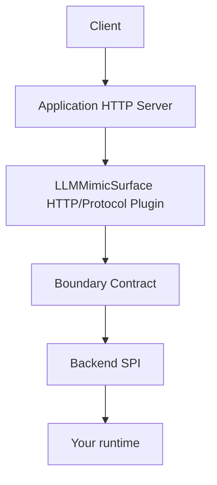

# llm-mimic-surface

Bring your own backend. Expose it through familiar AI APIs.

このパッケージは **External API Interface 層** です。LLM プロキシでも LLM コアでもありません。OpenAI / Anthropic / Gemini / xAI クライアントからのリクエストを小さな Boundary Contract に変換し、利用者が渡した Backend へ転送します。

```text
Client → Application HTTP Server → LLMMimicSurface Plugin → Backend SPI → 任意の Core
```

## なぜ必要か

ローカル Agent や Core は、ベンダー API を話さないことが多いです。一方で SDK や curl はベンダー API を話します。このライブラリはその間の surface です。

- `http://127.0.0.1:PORT/v1` を向ける OpenAI SDK
- ローカル Messages エンドポイントを向ける Anthropic SDK
- Gemini REST `generateContent`
- xAI / Grok の Chat Completions と Responses
- 自分で追加する Custom Protocol

LLM Provider への接続、Provider の API Key 管理、モデルルーティング、モデル実行そのものは **Backend 側の責務** です。

## 対応 Protocol

| Protocol | 種類 | 説明 |
| --- | --- | --- |
| OpenAI | 本体の Adapter | Chat Completions + Responses の subset |
| Anthropic | 本体の Adapter | Messages の subset |
| Gemini | 本体の Adapter | generateContent の subset |
| xAI / Grok | 本体の dialect | OpenAI 互換 codec を共有しつつ xAI 固有 field を保持 |
| Custom | 公開 SPI | `createProtocolAdapter` / `createSimpleProtocol` |

xAI API shares significant compatibility with the OpenAI API, but is implemented as a separate protocol dialect so that xAI-specific capabilities can be preserved.

これらは **互換 subset** であり、完全互換ではありません。[docs/compatibility.md](docs/compatibility.md) を参照してください。

## Architecture



**Protocol Adapter ≠ Provider Adapter.** この OSS は OpenAI / Anthropic / Gemini / xAI を上流 Provider として呼びません。

## Quick Start

```ts
import {
  llmMimicSurfacePlugin,
  createEchoBackend,
  openAIProtocol,
  anthropicProtocol,
  geminiProtocol
} from "llm-mimic-surface";
import Fastify from "fastify";

const app = Fastify({ logger: true });

await app.register(llmMimicSurfacePlugin, {
  backend: createEchoBackend(),
  protocols: [openAIProtocol(), anthropicProtocol(), geminiProtocol()]
});

await app.listen({ host: "127.0.0.1", port: 8080 });
```

```sh
npx llm-mimic-surface serve --protocol openai --port 8080
```

デフォルトの bind 先は `127.0.0.1` です。

Agent2API のようなアプリケーションは HTTP Server を1つだけ生成し、その Server に `llmMimicSurfacePlugin` を登録します。ローカル検証用には `llm-mimic-surface/standalone` の `createStandaloneServer()` も利用できますが、これは補助APIです。

## OpenAI compatible API

- `POST /v1/chat/completions`（JSON と SSE）
- `POST /v1/responses`（JSON と SSE）
- `GET /v1/models`

Chat Completions と Responses は別々の wire protocol です。Backend の内部 API を Chat Completions 形式にはしません。

## Anthropic compatible API

- `POST /v1/messages`
- `stream: true` の SSE

変換対象: `system`, `messages`, content blocks, `max_tokens`, `temperature`, `tools`, `tool_choice`, `stream`。

## Gemini compatible API

- `POST /v1beta/models/{model}:generateContent`
- `POST /v1beta/models/{model}:streamGenerateContent`
- `?alt=sse`

変換対象: `contents`, `parts`, `systemInstruction`, `generationConfig`, `tools`。

## xAI / Grok compatible API

xAI は OpenAI と path が衝突します。同一 prefix で両方登録すると `RouteCollisionError` になります。

```ts
openAIProtocol({ prefix: "/openai" })
xaiProtocol({ prefix: "/xai" })
```

`search_parameters` や server-side tool（`web_search`, `x_search`, `code_interpreter`）は黙って破棄せず、`extensions.xai` / `ProviderTool` として保持します。

## Custom Protocol

```ts
createSimpleProtocol({ path: "/api/generate" })
```

第三者が `createProtocolAdapter()` で独自 External API を追加できます。

## Custom Backend

Backend は `invoke` / 任意の `stream` / `listModels` / `capabilities` を実装します。Fastify オブジェクトは受け取りません。

Backend が tools 非対応なら、tools 付きリクエストは protocol 固有エラーになります。prompt から tools を消して続行しません。

## headless_core example

`headless_core` はこの OSS の必須依存ではありません。[examples/headless-core](examples/headless-core) を参照してください。

## Streaming

Backend は `InvocationEvent` を yield します。Adapter が OpenAI SSE / Anthropic SSE / Gemini SSE へ変換します。Client 切断時は Backend に渡した `AbortSignal` を abort します。

## Error handling

内部エラーは `BackendError` に正規化し、各 Protocol の error JSON へ変換します。Backend 例外をそのまま Client へは返しません。

## Security

- bind先、TLS、認証、global middleware、logging、body limit、timeout はHost Applicationが所有します
- LLMMimicSurfaceはprotocol response/errorのserializeと、client切断からBackendの`AbortSignal`への変換を担当します
- standalone CLIのデフォルトbind先は`127.0.0.1`です

詳細は [SECURITY.md](SECURITY.md)。

## Compatibility policy

ベンダー API は変わります。このプロジェクトは:

- 実装している subset を明示する
- 未知 field を `raw` / `extensions` / `native` で保持する
- Protocol Adapter の version と Backend SPI の破壊的変更を混同しない
- 「完全互換」と書かない

## Non Goals

- LLM provider integration
- Provider credential management
- model routing / load balancing / fallback
- billing
- persistent conversation storage
- RAG
- agent orchestration

## Development

```sh
npm install
npm run check
```

## License

MIT。[LICENSE](LICENSE) を参照してください。
