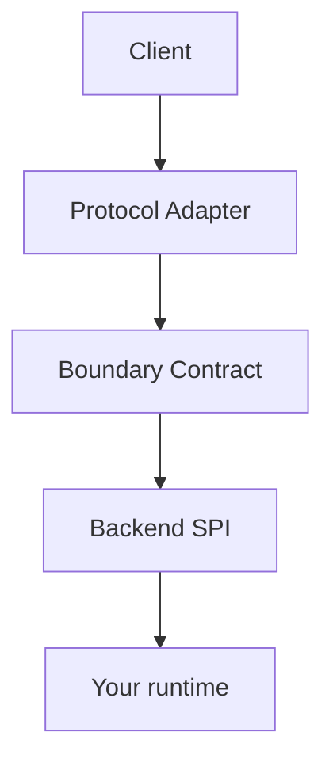

# llm-mimic-surface

Bring your own backend. Expose it through familiar AI APIs.

This package is an **External API Interface layer**, not an LLM proxy and not an LLM core. It accepts requests from OpenAI / Anthropic / Gemini / xAI clients, converts them to a small boundary contract, and forwards them to a backend you supply.

```text
Client  →  Protocol Adapter  →  Boundary Contract  →  Backend SPI  →  Your core
```

## Why

Local agents and cores rarely speak vendor APIs. SDKs and curl clients do. This library is the surface in between:

- OpenAI SDK pointed at `http://127.0.0.1:PORT/v1`
- Anthropic SDK pointed at a local Messages endpoint
- Gemini REST `generateContent`
- xAI / Grok Chat Completions and Responses
- A custom protocol you register yourself

LLM provider connections, API keys for those providers, model routing, and actual model execution stay in **your backend**.

## Supported protocols

| Protocol | Kind | Notes |
| --- | --- | --- |
| OpenAI | built-in adapter | Chat Completions + Responses subset |
| Anthropic | built-in adapter | Messages subset |
| Gemini | built-in adapter | generateContent subset |
| xAI / Grok | built-in dialect | Shares the OpenAI-compatible codec, keeps xAI fields |
| Custom | public SPI | `createProtocolAdapter` / `createSimpleProtocol` |

xAI API shares significant compatibility with the OpenAI API, but is implemented as a separate protocol dialect so that xAI-specific capabilities can be preserved.

These are **compatible subsets**, not complete vendor clones. See [docs/compatibility.md](docs/compatibility.md).

## Architecture



```text
                    Client
                      │
          ┌───────────┼───────────┐
          │           │           │
        OpenAI    Anthropic     Gemini
          │           │           │
          └─────┐     │     ┌─────┘
                │    xAI    │
                └─────┬─────┘
                      │
               Protocol Adapter
                      │
                Boundary Contract
                      │
                  Backend SPI
                      │
         ┌────────────┼────────────┐
         │            │            │
    headless_core   Custom Core   Mock
```

**Protocol Adapter ≠ Provider Adapter.** This repo does not call OpenAI, Anthropic, Gemini, or xAI as an upstream provider.

## Quick start

```sh
npm install llm-mimic-surface
```

```ts
import {
  createExternalApiServer,
  createEchoBackend,
  openAIProtocol,
  anthropicProtocol,
  geminiProtocol
} from "llm-mimic-surface";

const server = createExternalApiServer({
  backend: createEchoBackend(),
  protocols: [openAIProtocol(), anthropicProtocol(), geminiProtocol()],
  auth: false
});

await server.listen({ host: "127.0.0.1", port: 8080 });
```

```ts
import OpenAI from "openai";

const client = new OpenAI({
  baseURL: "http://127.0.0.1:8080/v1",
  apiKey: "dummy"
});

const completion = await client.chat.completions.create({
  model: "echo",
  messages: [{ role: "user", content: "hello" }]
});
```

CLI (mock backend):

```sh
npx llm-mimic-surface serve --protocol openai --port 8080
```

The process binds to `127.0.0.1` by default.

## OpenAI compatible API

Implemented subset:

- `POST /v1/chat/completions` (JSON and SSE)
- `POST /v1/responses` (JSON and SSE)
- `GET /v1/models`

Chat Completions and Responses are separate wire protocols. The backend never sees Chat Completions JSON as its native API.

Prefix example:

```ts
openAIProtocol({ prefix: "/openai" })
// POST /openai/v1/chat/completions
```

## Anthropic compatible API

- `POST /v1/messages`
- `stream: true` SSE (`message_start`, `content_block_*`, `message_stop`)

Converted fields: `system`, `messages`, content blocks, `max_tokens`, `temperature`, `tools`, `tool_choice`, `stream`.

## Gemini compatible API

- `POST /v1beta/models/{model}:generateContent`
- `POST /v1beta/models/{model}:streamGenerateContent`
- `?alt=sse`

Converted fields: `contents`, `parts`, `systemInstruction`, `generationConfig`, `tools`.

## xAI / Grok compatible API

```ts
import { createExternalApiServer, xaiProtocol } from "llm-mimic-surface";

const server = createExternalApiServer({
  backend,
  protocols: [xaiProtocol({ prefix: "/xai" })]
});
```

OpenAI and xAI share `/v1/chat/completions` by default. Registering both without prefixes throws a route collision error. Set prefixes:

```ts
openAIProtocol({ prefix: "/openai" })
xaiProtocol({ prefix: "/xai" })
```

xAI-only fields such as `search_parameters` and server-side tools (`web_search`, `x_search`, `code_interpreter`) are kept on `extensions.xai` / `ProviderTool`. They are not silently discarded and they are not rewritten as ordinary function tools.

## Custom protocol

```ts
import { createExternalApiServer, createEchoBackend, createSimpleProtocol } from "llm-mimic-surface";

const server = createExternalApiServer({
  backend: createEchoBackend(),
  protocols: [
    createSimpleProtocol({ path: "/api/generate" })
  ]
});
```

Or register any adapter:

```ts
import { createProtocolAdapter } from "llm-mimic-surface";

createProtocolAdapter({
  id: "ping",
  version: "1.0.0",
  registerRoutes(registrar) {
    registrar.route({
      method: "GET",
      path: "/ping",
      protocolId: "ping",
      encodeError: (error) => ({ status: error.status, body: { error: error.message } }),
      handler: async (_req, reply) => {
        await reply.send({ pong: true });
      }
    });
  }
});
```

## Custom backend

```ts
import type { ExternalApiBackend } from "llm-mimic-surface";

const backend: ExternalApiBackend = {
  capabilities: () => ({ streaming: true, tools: false, input: { text: true } }),
  async invoke(request) {
    return {
      id: "resp_local",
      model: request.model,
      message: {
        role: "assistant",
        content: [{ type: "text", text: "ok" }]
      },
      finishReason: "stop"
    };
  }
};
```

If a client sends `tools` and `capabilities().tools` is false, the protocol adapter returns an error. It will not strip tools and continue.

## headless_core example

`headless_core` is **not** a dependency of this package. See [examples/headless-core](examples/headless-core).

```text
OpenAI SDK → llm-mimic-surface → HeadlessCoreBackend → headless_core → Codex / Claude Code / Grok
```

Model ids such as `codex/default` and `claude/opus` are interpreted as `<agent>/<model>`.

## Streaming

Backends yield `InvocationEvent` values (`text.delta`, `tool_call.*`, `response.end`, …). Adapters convert those events to OpenAI SSE, Anthropic SSE, or Gemini SSE. Disconnecting the HTTP client aborts the `AbortSignal` passed to the backend.

## Error handling

Internal errors are normalized to `BackendError` (`invalid_request`, `unsupported_feature`, `model_not_found`, `rate_limit`, `timeout`, `aborted`, `backend_unavailable`, `internal_error`) and then encoded per protocol. Raw backend exceptions are not forwarded as-is.

## Security

- Default bind address: `127.0.0.1`
- Optional bearer / custom auth; `auth: false` is allowed for local development
- API keys and prompt bodies are not logged by default
- Body size limit, request timeout, CORS, and client-disconnect abort are enabled in the HTTP transport

See [SECURITY.md](SECURITY.md).

## Compatibility policy

Vendor APIs change. This project:

- documents the subset it implements
- preserves unknown fields through `raw` / `extensions` / `native`
- versions protocol adapters separately from the Backend SPI
- does not claim full compatibility

## Non-goals

- LLM provider integration
- credential management for provider APIs
- model routing / load balancing / fallback
- billing
- persistent conversation storage
- RAG
- agent orchestration

## Development

```sh
npm install
npm run check
```

`npm run check` runs lint, typecheck, test, and build.

## License

MIT. See [LICENSE](LICENSE).
