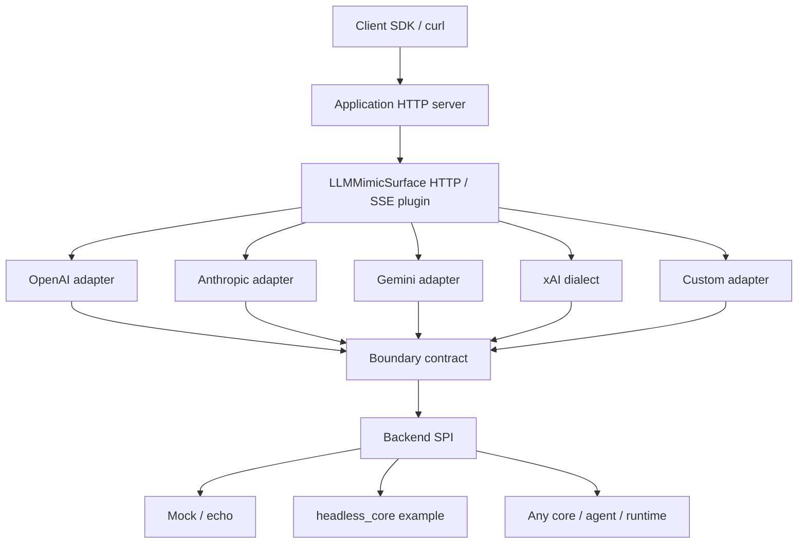

# Architecture

`llm-mimic-surface` is an **External API Interface layer**. It is not an LLM core, proxy, router, or agent runtime.

```text
Client
  │
  ▼
Application HTTP Server
Agent2API / another Fastify host
  │
  ▼
LLMMimicSurface Plugin
HTTP handlers / SSE / protocol routes
  │
  ▼
Protocol Adapter
OpenAI / Anthropic / Gemini / xAI / Custom
  │
  ▼
Boundary Contract
  │
  ▼
Backend SPI
  │
  ▼
User supplied backend
```



## Layers

| Layer | Responsibility | Must not do |
| --- | --- | --- |
| HTTP plugin | Routes, request parsing, response/error/SSE serialization, disconnect AbortSignal | Listen on a port, own TLS/auth/global middleware/logging/lifecycle |
| Protocol adapter | Decode/encode wire format | Call an LLM provider |
| Boundary | Shared request/response/event contract | Become an LLM core |
| Backend SPI | Invoke user code | See Fastify or protocol SSE events |

**Protocol Adapter ≠ Provider Adapter.** A protocol adapter exposes an external API shape. A provider adapter would call OpenAI/Anthropic/Gemini/xAI with API keys. Provider adapters are out of scope.

## Host boundary

The primary API is `llmMimicSurfacePlugin`. The host creates Fastify, registers application auth and middleware, registers this plugin, and owns `listen()` and graceful shutdown. `llm-mimic-surface/standalone` is only a convenience layer for local verification.

LLMMimicSurface depends only on the `ExternalApiBackend` contract. Agent2API can implement that contract with an adapter around its own core; LLMMimicSurface does not depend on `headless_core`.

## Streaming

Backends emit `InvocationEvent` values. Each protocol adapter converts those events to its own SSE/JSON stream. Protocol-specific event names never leak into the backend.

## Route collision

OpenAI and xAI default to `/v1/chat/completions`, `/v1/responses`, and `/v1/models`. Registering both without prefixes throws `RouteCollisionError`. Use prefixes such as `/openai` and `/xai`.
